# DigiLab

**[LAB401](https://lab401.com)'sDigiLab** by **[tixlegeek](https://cyberpunk.company)** is an additional hardware module designed for the **[Flipper Zero](https://flipperzero.one/)**. It adds a digital electronics workbench to the Flipper zero, allowing the user to measure voltages and frequencies, as well as probing/scanning I2C and SPI devices, and interract with I2C Devices via a handy hexadecimal editor.

This module offers convenient functionality for those who want to explore digital electronic circuits, debug, and analyse digital signals and voltages.

Whether in headless mode or using an external probe on its SMA port, the DigiLab lets you observe what’s happening and can be finely tuned to give you a clearer view of your analysis before resorting to larger specialized tools. Pull it out of your pocket and perform analyses wherever you are! It’s a unique, educational, and entertaining companion to the Flipper Zero, allowing you to add an entirely new field of exploration to your favorite dolphin.

## How it works?

This module embeds a sophisticated electronic system that enables hands-on diagnostics and empirical analysis. It also allows users to hear, feel, and see signals through a set of tools carefully designed for anyone seeking a simple and efficient way to explore and understand the inner workings of low-voltage appliances.

## How to use

Plug the device on the GPIO header of the flipper zero, then download an install the latest firmware's version on your flipper zero. 
Once everything is installed, navigate to **/Apps/GPIO/401LightDigiLab** to launch the application.

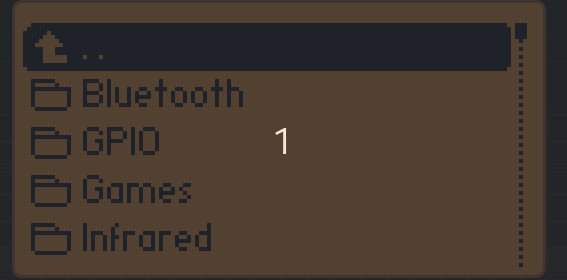

Press any key to enter the main menu. From here, you can navigate throught every tools.

## I2C Probe

DigiLab's I2C probe will automatically scan for I2C devices connected throuhgt one of the I2C connection points. An integrated I2C eeprom is mounted on the Digilab so you can test and play around out of the box. You can also store some informations on it if you want.

### Scanned devices

Once the scan is done, you will see every component detected as shown in this illustration:

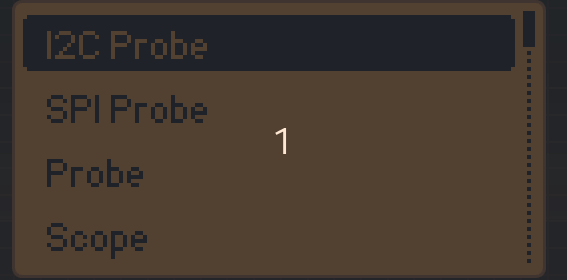

Loop throught detected components using left and right arrows on your flipper zero's weheel.

#### Detection screen

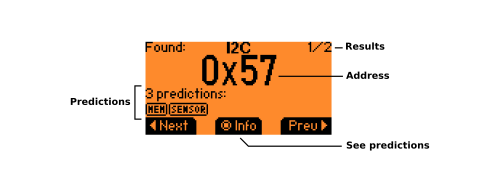

### Predictions

DigiLab will try to make predictions on the device scanned, based on it's address. By pressing "Info" on a known device, you will access the prediction menu. From here you can loop throught every predictions and see more details about them.

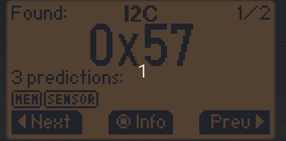

#### Prediction screen

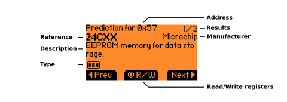

### Read/Write

DigiLab also embeds a handy hexadecimal editor. You can try to read or write registers by entering the **R/W** tool.

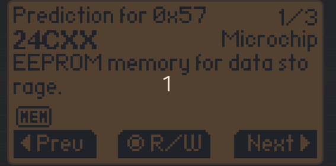

#### How to use the hexadecimal editor:

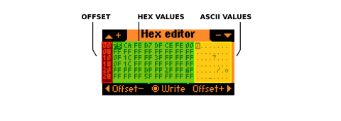

1. Set the **OFFSET** (Register's address, or address from where you'd wish to start reading)
2. Set the **DATA LEN** (The number of octets to be red from the device)
3. Navigate the data using arrows:
   1. **Short press on Left/Right**: Select the octet to edit
   2. **Long press on Left/Right:** Navigate faster throught octets.
   3. **Short press on Up/Down:** Increment/Decrement octet's value.
   4. **Long press on Up/Down:** Increment/Decrement octets value by increments of 16(d) (= increment or decrement the 4 most significative bits of the octets)
   5. **OK:** Save/send.
   6. **Return:** Quits the hexadecimal editor.

## SPI Probe

Digilab's SPI probe allows you to predict devices connected to the external SPI port of the flipper zero. DigiLab will realise a set of tests, trying to identify a device.

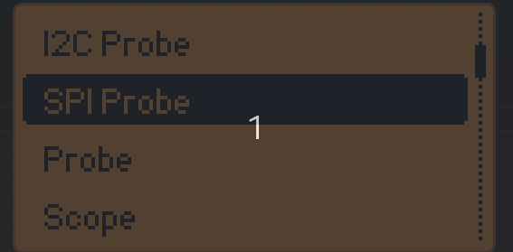

## Probe

Digilab's Probe tool allows to clearly measure voltages and frequencies up to 200kHz. This is really useful on a lot of situations where you need to quickly know what you're dealing with.

The probe will try to determine if the signal is continuous or not, and will give you a simple feedback

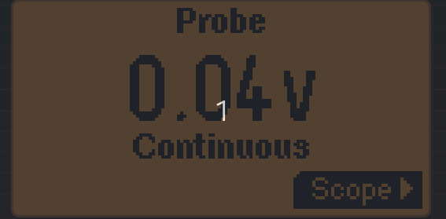

## Scope

The DigiLab's Scope tool allows you to (almost magically) get an intuitive sense of all kinds of signals. It's more like a magic wand than a traditional oscilloscope.

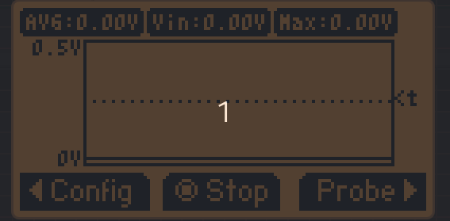

At first glance, it might look like an oscilloscope, allowing you to easily check voltages and get an initial view of how a voltage evolves over time. 

You can easily view the voltage, the maximum voltage, and the average voltage on the main screen, in addition to the time-based visualization.

### Physical Feedback Configuration

The DigiLab allows you to link multiple physical feedback mechanisms to measured values or alerts. For example, you can configure an audible feedback for the voltage or set the probe's LED to light up when the voltage exceeds 5V.

Do do that, press **Left** to enter configuration.

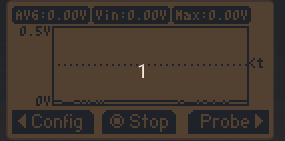

#### Scope tool config

The Scope comes with a bunch of nice feedback configuration, allowing the user to sense signals by probing any less-than-12V circuitry.

- **Sound**:
  - **OFF**: No sound feedback
  - **Alert**: Follows the **Alert condition**
  - **ON**: Follows the voltage measured
- **Vibro**:
  - **OFF**: No vibro feedback
  - **Alert**: Follows the **Alert condition**
- **LED**:
  - **OFF**: No led feedback
  - **Alert**: Follows the **Alert condition**
  - **Follow**: Follows the measured voltage
  - **Variance**: Follows the computed variance of the measured signal.
  - **Trigger**: Follows when the signal crosses the soft-computed trigger level.
- **Alert** (= alert-condition):
  - **u(>/<)x**: True when **u** (measured voltage) is **less than x**, or **greater than x**. For example; u<3.3 will be true wen u is less than 3.3v
  - **Osc**: True when the signal oscillates around 0v (digital signals, clocks, communications...)
  - **~x**: True when the measured signal is close to xV

## Calibration

You need to calibrate the voltage measurement to ensure its accuracy. Note that the DigiLab is not a precision measurement tool. However, it can provide accurate readings once properly calibrated.

To do that, go to **Configuration** in the main menu.

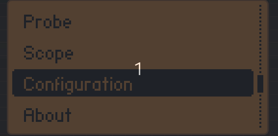

Then Probe the 5V Test pad at on the tom left corner of the digilab as shown bellow:
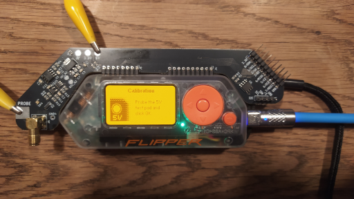

While probing, press the **OK** button. You can then leave the menu by pressing **Return**

The calibration value will then be stored inside **config.json** on the SD Card.

## Capabilities:

Lab401's DigiLab by tixlegeek is able to measure in those limits:

**Voltage** between 0 and 12V

**Frequencies** between a few hertz to about 200Khz

**Scope's Resolution** is quite low is much more limited in frequencies, also do not expect to see high speed signals accurately on the oscillogram.

**SPI** and **I2C** devices **must be 3.3V compatible**

You can use **BusPiratev5** hardware on the dedicated port

## Contributing

## Developpement